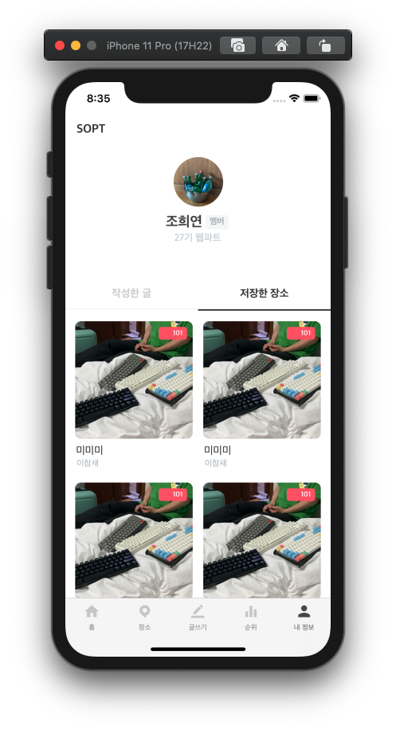

## 🟢P.P 해커톤 정리

### MypageScene



##### 🗂**Foldering**

```swift
MypageScene
├── Mypage.storyboard
└── View
    ├── Cell
    │   ├── OutterTVC
    │   │   ├── ContainTVC.swift
    │   │   ├── ContainTVC.xib
    │   │   ├── ProfileTVC.swift
    │   │   └── ProfileTVC.xib
    │   └── PagingTab
    │       ├── PagingContainCVC
    │       │   ├── StoredContainCVC.swift
    │       │   ├── StoredContainCVC.xib
    │       │   ├── WrittenContainCVC.swift
    │       │   └── WrittenContainCVC.xib
    │       ├── PaingCVC
    │       │   ├── StoredCVC.swift
    │       │   ├── StoredCVC.xib
    │       │   ├── WrittenCVC.swift
    │       │   └── WrittenCVC.xib
    │       ├── TabCVC.swift
    │       └── TabCVC.xib
    └── VC
        └── MypageVC.swift
```


- <h4>xib</h4>

  ```swift
  let nib = UINib(nibName: WrittenCVC.nibName, bundle: nil)
  let storenib = UINib(nibName: StoredCVC.nibName, bundle: nil)
          
  collectionView.register(nib, forCellWithReuseIdentifier: WrittenCVC.reuseIdentifier)
  collectionView.register(storenib, forCellWithReuseIdentifier: StoredCVC.reuseIdentifier)
  ```


- #### UIView

  ```swift
  let highlightingView: UIView = {
    let v = UIView()
    let width = UIScreen.main.bounds.width //넓이를 상위뷰와 똑같이
    //= self.view.frame.width *완벽하게 같은 코드는 아님 -> 뷰컨이 없으면 X
          
    v.backgroundColor = UIColor.gray90
    v.frame = CGRect.init(x: 0, y: 0, width: 174 , height: 1)
    v.translatesAutoresizingMaskIntoConstraints = false 
    //*** 오토레이아웃을 코드로 잡을때 무조건 이것을 해줘야함
    return v
  }()
  ```


- <h4>xib</h4>

  ```swift
  let nib = UINib(nibName: WrittenCVC.nibName, bundle: nil)
  let storenib = UINib(nibName: StoredCVC.nibName, bundle: nil)
          
  collectionView.register(nib, forCellWithReuseIdentifier: WrittenCVC.reuseIdentifier)
  collectionView.register(storenib, forCellWithReuseIdentifier: StoredCVC.reuseIdentifier)
  ```


- <h4>CollectionView</h4>

  ```swift
  let tabCollectionView: UICollectionView = {
    let width = UIScreen.main.bounds.width
    let frame = CGRect(x: 0, y: 0, width: width, height: 44)
  
    let layout = UICollectionViewFlowLayout()
    layout.minimumInteritemSpacing = .zero
    layout.minimumLineSpacing = .zero
    layout.scrollDirection = .horizontal
  
    let tabCV = UICollectionView(frame: frame, collectionViewLayout: layout)
        
    tabCV.layer.addBorder([.bottom], color: UIColor.gray30, width: 1.0)
         
    tabCV.register(TabCVC.self, forCellWithReuseIdentifier: TabCVC.reuseIdentifier)
    tabCV.translatesAutoresizingMaskIntoConstraints = false
    tabCV.isPagingEnabled = true
        
    return tabCV
  }()
  ```

  

  - **UICollectionViewDelegateFlowLayout (2x2 정렬)**

    ```swift
    extension WrittenCVC : UICollectionViewDelegateFlowLayout{
    
      func collectionView(_ collectionView: UICollectionView, layout collectionViewLayout: UICollectionViewLayout, sizeForItemAt indexPath: IndexPath) -> CGSize {
        let width = (UIScreen.main.bounds.width - 43) / 2
        //셀 좌우 , 셀사이의 간격을 제외하고 2로 나누기
        let divisor = pow(10.0, CGFloat(1))
        let roundedWidth = (width * divisor).rounded() / divisor
        //디바이스 사이즈에 맞도록 비율로 계산해서 조정
        let roundedHeight = roundedWidth * (214 / width)
        return CGSize(width: roundedWidth, height: roundedHeight)
    }
    
      func collectionView(_ collectionView: UICollectionView, layout collectionViewLayout: UICollectionViewLayout, minimumLineSpacingForSectionAt section: Int) -> CGFloat {
        return 14 //위 아래의 간격 조정
     }
      
      func collectionView(_ collectionView: UICollectionView, layout collectionViewLayout: UICollectionViewLayout, minimumInteritemSpacingForSectionAt section: Int) -> CGFloat {
          return 15 //좌우 간격 조정
      }
    
      func collectionView(_ collectionView: UICollectionView, layout collectionViewLayout: UICollectionViewLayout, insetForSectionAt section: Int) -> UIEdgeInsets {
        return UIEdgeInsets(top: 25, left: 14, bottom: 14, right: 14)
        //컬렉션뷰의 시작 위치를 지정
      }
    
      func collectionView(_ collectionView: UICollectionView, layout collectionViewLayout: UICollectionViewLayout, referenceSizeForHeaderInSection section: Int) -> CGSize {
        return CGSize(width: UIScreen.main.bounds.width, height: 14)
      }
    }
    ```

    

  - **CALayer**

    UIView 위,아래,좌,우 원하는 곳에만 border적용이 가능

    ```swift
    extension CALayer {
      func addBorder(_ arr_edge: [UIRectEdge], color: UIColor, width: CGFloat) {
        for edge in arr_edge {
          let border = CALayer()
          switch edge {
            case UIRectEdge.top:
            	border.frame = CGRect.init(x: 0, y: 0, width: frame.width, height: width)
            	break
            case UIRectEdge.bottom:
            	border.frame = CGRect.init(x: 0, y: frame.height - width, width: frame.width, height: width)
            	break
            case UIRectEdge.left:
            	border.frame = CGRect.init(x: 0, y: 0, width: width, height: frame.height)
              break
            case UIRectEdge.right:
              border.frame = CGRect.init(x: frame.width - width, y: 0, width: width, height: frame.height)
              break
             default:
               break
          }
          border.backgroundColor = color.cgColor
          self.addSublayer(border)
        }
      }
    }
    ```

    

- #### RefreshControl

  ```swift
  private func setupRefreshControl() {
    let attributedString = [NSAttributedString.Key.foregroundColor: UIColor.white]
    let refreshControl: UIRefreshControl!
    refreshControl = UIRefreshControl()
    refreshControl.addTarget(self, action: #selector(updateUI(refresh:)), for: .valueChanged)
    refreshControl.backgroundColor = UIColor.white
    refreshControl.tintColor = UIColor.black
    refreshControl.attributedTitle = NSAttributedString(string: "새로고침", attributes: attributedString)
    
    tableView.addSubview(refreshControl)
  }
  
  @objc
  func updateUI(refresh: UIRefreshControl) {
    refresh.endRefreshing()
    tableView.reloadData()
  }
  ```

